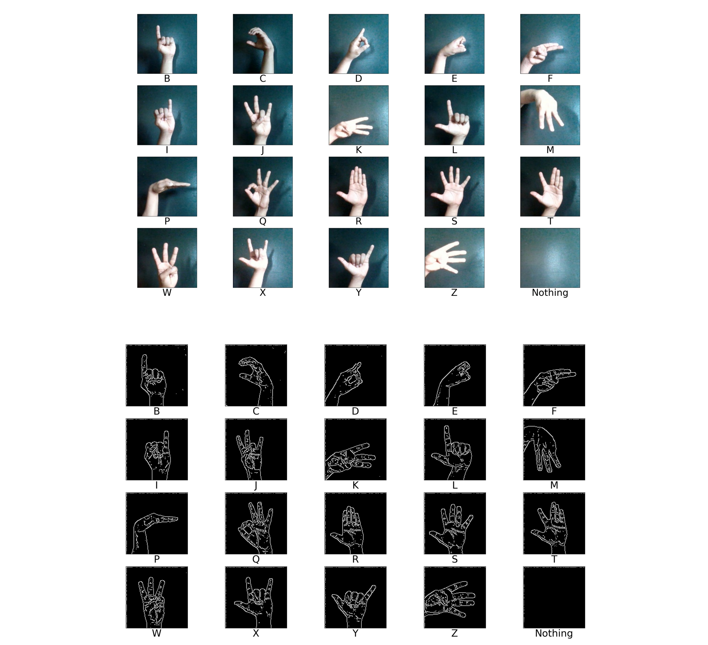

# Sign Language Translator Using Deep Learning & OpenCV
### Description
Real time application that is meant to assist the speech and hearing impaired people by providing a means of communication. This application is able to convert hand gestures to speech for the speech impaired person and speech to gestures for communicating with the hearing impaired person. 
The programming language used is Python. 
The image processing and hand detection is done using OpenCV.  
The sign languages are classified using a Convolutional Neural Network created using Tensorflow ans has 100% test accuracy and 98% real time accuracy. 
Text to speech conversion is done using pyttsx3. The model is trained in a self made dataset with 27 classes(26 alphabets + space) having 5000 images in each class. 
Conversion of speech to text is done using SpeechRecognition. 
The Graphic User Interface is made using Kivy. 

### Repository Contents
* ``Scripts : ``  
&nbsp;&nbsp;&nbsp;&nbsp;&nbsp; ``CollectData.py`` - It is used to create our own dataset for training our Deep Learning Model. 
&nbsp;&nbsp;&nbsp;&nbsp;&nbsp; ``GenerateData.py`` -  It is used to generate more data by Image Augmentation for training our Deep &nbsp;&nbsp;Learning Model.  
&nbsp;&nbsp;&nbsp;&nbsp;&nbsp; ``DataSplit.py`` -  It is a helper script used to split our data into train and validation &nbsp;&nbsp;sets. 
&nbsp;&nbsp;&nbsp;&nbsp;&nbsp; ``ViewData.py`` -  It is a helper script used to visualize dataset. 
&nbsp;&nbsp;&nbsp;&nbsp;&nbsp; ``GestureToSpeech.py`` -  It is the script used to convert gestures to speech in &nbsp;&nbsp;realtime. 
&nbsp;&nbsp;&nbsp;&nbsp;&nbsp; ``SpeechToGesture.py`` -  It is the script used to convert speech to gestures in &nbsp;&nbsp;realtime. 
&nbsp;&nbsp;&nbsp;&nbsp;&nbsp; ``Main.py`` -  It is the main script used for running the application on command line. 
&nbsp;&nbsp;&nbsp;&nbsp;&nbsp; ``Application.py`` -  It is the main script used for running the application in a GUI.  
&nbsp;&nbsp;&nbsp;&nbsp;&nbsp; ``Design.kv`` -  This kv file contains the GUI designing code.

* ``Model : ``  
&nbsp;&nbsp;&nbsp;&nbsp;&nbsp; ``Model.ipynb`` - It is the Python Notebook used to create the CNN model for gesture classification. 
&nbsp;&nbsp;&nbsp;&nbsp;&nbsp; ``Model.json`` -  It contains the structural details of the CNN model. 
&nbsp;&nbsp;&nbsp;&nbsp;&nbsp; ``Model.h5`` -  It contains the weights of the CNN model.

* ``Data Sample : `` &nbsp; It is just a sample of the dataset used to train the model.

* ``Output : `` &nbsp; It contains the output plots & reports of the CNN model performance.

* ``Requirements.txt : `` &nbsp; List of dependencies used.

### Setting Up Environment (For Windows)
1. Create a folder named as Sign Language Translator and download all files from the repository into it.
2. Open command line and navigate to the folder & make sure your system has Python installed and is set to path.
3. Now install Virtualenv - ``pip install virtualenv``
4. Now create a virtual environment - ``python -m venv venv`` and activate virtual environment - ``venv\Scripts\activate``
5. Now install the below dependencies :  
&nbsp;&nbsp;&nbsp;&nbsp;&nbsp;Numpy - ``pip install numpy`` 
&nbsp;&nbsp;&nbsp;&nbsp;&nbsp;Matplotlib - ``pip install matplotlib`` 
&nbsp;&nbsp;&nbsp;&nbsp;&nbsp;OpenCV - ``pip install opencv-python`` 
&nbsp;&nbsp;&nbsp;&nbsp;&nbsp;SpeechRecognition - ``pip install SpeechRecognition`` 
&nbsp;&nbsp;&nbsp;&nbsp;&nbsp;Tensorflow - ``pip install tensorflow`` 
&nbsp;&nbsp;&nbsp;&nbsp;&nbsp;Pyttsx3 - ``pip install pyttsx3`` 
&nbsp;&nbsp;&nbsp;&nbsp;&nbsp;Zipfile38 - ``pip install zipfile38`` 
&nbsp;&nbsp;&nbsp;&nbsp;&nbsp;Split-Folders - ``pip install split-folders`` 
&nbsp;&nbsp;&nbsp;&nbsp;&nbsp;Kivy - ``python -m pip install kivy[base] kivy-examples --no-binary kivy`` 
&nbsp;&nbsp;&nbsp;&nbsp;&nbsp;Pipwin - ``pip install pipwin`` 
&nbsp;&nbsp;&nbsp;&nbsp;&nbsp;PyAudio - ``pipwin install pyaudio`` 

### Running Application
Run application by first navigating to the Scripts folder and the executing the command - ``python Application.py`` in the command line.

### Dataset
Download Dataset from drive using this [link](https://drive.google.com/file/d/16h4wkGJ1jU4ARjUfO-9c8nuRc6Hzj_zK/view?usp=sharing)  
Dataset before and after preprocessing

### App Demo
<figure class="video_container">
  <video controls="true" allowfullscreen="true" poster="path/to/poster_image.png">
    <source src="Output/OP.mp4" type="video/mp4">
  </video>
</figure>

